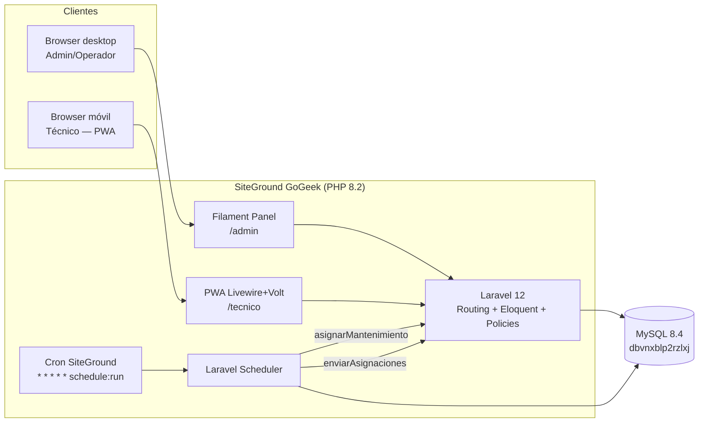
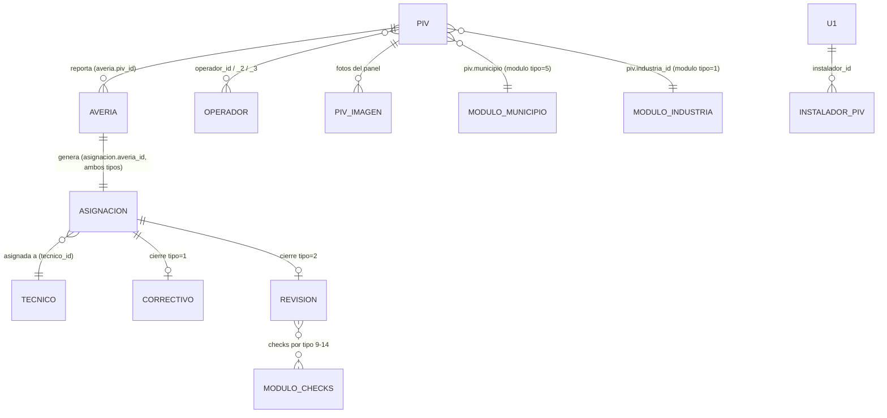

# Arquitectura — Winfin PIV

## 1. Visión general

Winfin PIV es un **CMMS** (Computerised Maintenance Management System) que gestiona el ciclo de vida operativo de **575 paneles de información al viajero** instalados en marquesinas de autobús: alta de incidencias por parte del operador, asignación a técnico, cierre con foto, revisiones mensuales programadas y reporting al cliente. Es **single-tenant** (Winfin Systems S.L.), web responsive con un panel Filament para back-office y una PWA Livewire para los técnicos en campo. **Sin integración con los paneles físicos**: toda la operativa es humana.

---

## 2. Contexto histórico

Existe una app PHP procedural (2014, retoques en 2025) en `https://winfin.es`. Funciona, pero arrastra deuda técnica grave que justifica reescritura completa en lugar de parcheo:

1. **Sesiones inconsistentes**: `header.php` lee `$_SESSION['user_level']` mientras `login.php` escribe `$_SESSION['userId']` → el menú no se renderiza correctamente en ningún rol según el flujo de código.
2. **Contraseñas en SHA1 sin sal** en las tablas `u1`, `tecnico`, `operador` — vulnerables a rainbow tables.
3. **`unserialize()` sobre cookie `admin_settings`** en `functions.php` — vector RCE clásico (CVE pattern).
4. **Dump SQL completo expuesto públicamente**: `https://winfin.es/serv19h17935_winfin_2025-04-25_07-53-24.sql` descargable por cualquiera, contiene contraseñas y datos personales — **incidente RGPD pendiente**.
5. **Charset mezclado**: tablas en `latin1`, conexión `utf8mb4`, `header.php` declara `utf-8`, `login.php` declara `ISO-8859-1`. Eñes y tildes inconsistentes.
6. **Sin CSRF** en formularios.
7. **PHP 8.2 marca deprecated** la creación dinámica de la propiedad `Piv::$tecnico_id` en `classes/Piv.php:42`. En PHP 9 será error fatal.
8. **Archivos `* copia*`** por todos lados (`paneles copia 2.php`, `login copia 1.php`...) — versionado manual sin documentar.
9. **Git con un único commit** ("Primer guardado de la app") y muchos cambios sin commitear.
10. **Bug de datos**: técnicos registran las **revisiones mensuales** rutinarias como **averías reales** (`asignacion.tipo=1`) con notas tipo `"REVISION MENSUAL Y OK"` en lugar de usar `tipo=2`. Contamina los KPIs del cliente.
11. **Sin tests, sin CI, sin documentación**.

**Por qué reescribir y no parchear**: los puntos 1-3 y 5 son arquitectónicos (sesión, charset, criptografía, deserialización). Refactorizarlos in-situ exige tocar prácticamente todos los archivos; cuesta lo mismo levantar Laravel encima de la misma BD y cortar a tajadas.

---

## 3. Stack y por qué

- **Laravel 12** — framework PHP maduro y soportado, ORM Eloquent ideal para una BD legacy con tablas reutilizadas.
- **Filament 3.2** — admin panel completo "out of the box": tablas, filtros, formularios, policies, widgets. Reduce semanas de UI back-office.
- **Livewire 3 + Volt + Tailwind 3** — UI reactiva mobile-first sin SPA framework; mantiene PHP como única fuente y permite PWA sin compilar a otra plataforma.
- **PWA (no nativa)** — los técnicos solo necesitan cámara, formulario y notificación push; la PWA cubre los tres con cero coste de tiendas.
- **Fortify (sin Breeze)** — el scaffolding visual de Breeze sobra; Fortify expone solo la lógica de auth, que integramos con Filament + nuestro guard custom SHA1→bcrypt.
- **Driver de queue `database`** — SiteGround GoGeek es compartido y no permite workers persistentes; usamos cron de SiteGround → `schedule:run` cada minuto.
- **Pest 3** — tests legibles, integración nativa con Laravel. (Versión instalada: 3.8.6 + pest-plugin-laravel 3.x. Pest 4 requiere PHP 8.3+, incompatible con prod SiteGround 8.2.30.)
- **MySQL existente (`dbvnxblp2rzlxj`)** — coexistencia con la app vieja sin migración de datos.

---

## 4. Arquitectura lógica



---

## 5. Modelo de dominio

### 5.1 Tablas legacy reutilizadas (NO se altera schema en Fase 1)

> **Schema verificado contra `INFORMATION_SCHEMA` en producción 2026-04-30.** Esta sección reemplaza la versión planificada inicial — ver ADRs 0006/0007/0008 para decisiones derivadas de las divergencias encontradas. Convenciones legacy comunes: PKs son `<tabla>_id` (excepto `u1` que usa `user_id`); columnas password se llaman `clave` en `tecnico` y `operador` (solo `u1.password` se llama `password`); status usa tinyint con `1=activo` por convención; charset MySQL es `latin1` con conexión `utf8mb4` (mojibake en lectura — ver §11 y Bloque 03 mutators obligatorios).

| Tabla | PK | Columnas (orden BD) | Tipo / Notas |
|-------|----|----|----|
| `piv` (575 filas) | `piv_id` | `parada_cod`, `cc_cod`, `fecha_instalacion`, `n_serie_piv`, `n_serie_sim`, `n_serie_mgp`, `tipo_piv`, `tipo_marquesina`, `tipo_alimentacion`, `industria_id`, `concesionaria_id`, `direccion`, `municipio`, `status`, `operador_id`, `operador_id_2`, `operador_id_3`, `prevision`, `observaciones`, `mantenimiento`, `status2` | Panel físico. **Sin `lat`/`lng`**: si la PWA operador necesita mapa, requiere geocoding desde `direccion`+`municipio`. `municipio` es varchar con `modulo_id` numérico (ver ADR-0007). `mantenimiento` es varchar(45), no fecha. `industria_id` y `concesionaria_id` apuntan a `modulo` (tipos 1 y ?). |
| `averia` (66 392 filas) | `averia_id` | `operador_id`, `piv_id`, `notas` (varchar 500), `fecha` (TIMESTAMP default CURRENT_TIMESTAMP), `status`, `tecnico_id` | Incidencia reportada. Tiene `tecnico_id` (originalmente no documentado). |
| `asignacion` (66 404 filas) | `asignacion_id` | `tecnico_id`, `fecha` (date), `hora_inicial`, `hora_final` (int), `tipo` (tinyint: 1=correctivo, 2=revisión), `averia_id` (int unsigned), `status` | Asignación técnico↔avería. **Sin `piv_id` directo**: se llega al PIV vía `averia_id → averia.piv_id`. Toda asignación REQUIERE `averia_id` (incluidas las tipo=2 — la app vieja crea avería stub para revisiones rutinarias; ver §7.b). `hora_inicial`/`hora_final` no documentados originalmente. |
| `correctivo` (65 901 filas) | `correctivo_id` | `tecnico_id`, `asignacion_id`, `tiempo` (varchar(45) — horas decimales tipo "0.5"), `contrato`, `facturar_horas`, `facturar_desplazamiento`, `facturar_recambios` (4 tinyint), `recambios` (varchar(255) — qué se cambió/hizo), `diagnostico` (varchar(255)), `estado_final` (varchar(100) — típicamente "OK") | Cierre tipo=1. **Sin `accion`, `fecha`, `imagen`** (lo que ARCHITECTURE asumía). Decisión arquitectónica de mapeo en ADR-0006: `recambios` cumple rol de "acción"; nueva tabla `lv_correctivo_imagen` para fotos. |
| `revision` (filas) | `revision_id` (int unsigned) | `tecnico_id`, `asignacion_id`, `fecha` (varchar(100) — formatos heterogéneos), `ruta` (varchar(100)), `aspecto`, `funcionamiento`, `actuacion`, `audio`, `lineas`, `fecha_hora`, `precision_paso` (varchar(100) cada uno — texto libre, no enum), `notas` (varchar(100)) | Cierre tipo=2. Los checks son texto libre (no `OK`/`KO` enforced en DB; el front los limita a esos valores). |
| `tecnico` (65 filas, 3 activos) | `tecnico_id` | `usuario`, **`clave`** (varchar(200) SHA1), `email`, `nombre_completo`, `dni`, `carnet_conducir`, `direccion`, `ccc`, `n_seguridad_social`, `telefono`, `status` (tinyint default 1) | **Password legacy se llama `clave`, NO `password`** — ver ADR-0008. Datos RGPD sensibles: `dni`, `n_seguridad_social`, `ccc`, `telefono`, `direccion`, `email`, `carnet_conducir`. |
| `operador` (41 filas) | `operador_id` | `usuario`, **`clave`** (varchar(255) SHA1), `email`, `domicilio`, `lineas`, `responsable`, `razon_social`, `cif`, `status` | Password legacy `clave` (no `password`). `razon_social` es el nombre comercial (no `nombre`). |
| `modulo` (200+ filas) | `modulo_id` | `nombre`, `tipo` (int) | Catálogo polimórfico — ver §5.3 con tipos completos. |
| `piv_imagen` (1135 filas) | `piv_imagen_id` | `piv_id`, **`url`** (varchar(255), no `path`), **`posicion`** (int, no `fecha`) | AUTO_INCREMENT=1510 → 375 huérfanos. Sin info temporal. |
| `instalador_piv` | `instalador_piv_id` | `piv_id`, **`instalador_id`** (FK a `u1.user_id`, no texto libre) | Histórico instalación. Sin `fecha`. |
| `desinstalado_piv` | `desinstalado_piv_id` (int unsigned) | `piv_id`, `observaciones` (varchar 500), `pos` (int) | Histórico desinstalación. **Sin `fecha`, sin `motivo` enum** — toda la info en texto libre. |
| `reinstalado_piv` | `reinstalado_piv_id` (int unsigned) | `piv_id`, `observaciones` (varchar 500), `pos` (int) | Histórico reinstalación. Sin `fecha`. |
| `u1` (1 fila) | **`user_id`** (NO `u1_id`) | `username`, `password` (varchar 255 SHA1), `email` | Admins. **Excepción a la convención de PKs `<tabla>_id`** — ver ADR-0008. Aquí sí se llama `password`. |
| `session` (legacy PHP) | `session_id` (varchar 255) | `user_id` (varchar 255), `rol` (int) | Tabla legacy de sesiones PHP. La nueva app NO la toca; Laravel usa `lv_sessions`. |

**Nota sobre el `status`**: la app vieja usa varios significados para `status` según tabla. En `piv` también hay un `status2` (probablemente snapshot del estado del PIV en cada momento). Sin diccionario formal — investigación pendiente cuando llegue el dashboard (Bloque 10).

### 5.2 Diagrama ER simplificado



> **Importante**: la app vieja crea **una avería stub** incluso para revisiones mensuales rutinarias (`asignacion.tipo=2`), porque `asignacion` no tiene `piv_id` directo. El bug histórico de "REVISION MENSUAL" (ADR-0004) es consecuencia: la avería stub se rellena con `notas="REVISION MENSUAL Y OK"` y se queda como tipo=1 si el formulario `calendar.php` no cambia el dropdown a "Mantenimiento".

### 5.3 Catálogo `modulo` (polimórfico por `tipo`) — schema completo verificado

`modulo` es realmente un catálogo de catálogos. La tabla tiene **12 tipos distintos**, cada uno representando una categoría de valores reutilizables.

| `tipo` | Uso | Ejemplos | Apuntada por |
|--------|-----|----------|--------------|
| 1 | Marca/Industria del PIV (fabricante) | EOR, GMV, PRO, ETR, EOR/GMV | `piv.industria_id` |
| 2 | Tipo de pantalla del PIV | Simple, Doble, TFT, Bus | (probable `piv.tipo_piv` por nombre, pendiente confirmar) |
| 3 | Tipo de marquesina | Códigos crípticos tipo "MU Marq CTM (acera est lat)" | (probable `piv.tipo_marquesina`, pendiente) |
| 4 | Tipo de alimentación eléctrica | Alumbrado público 24h, Alumbrado público nocturno, Pte. Ayto. acometida permanente | (probable `piv.tipo_alimentacion`, pendiente) |
| **5** | **Municipios** (103 valores) | Alcalá de Henares, Alcobendas, Alcorcón, Aranjuez, Madrid… | `piv.municipio` (VARCHAR con `modulo_id` numérico — ver ADR-0007) |
| 6 | Estado del PIV (texto) | "En Rev.", "OK", "Retirada" | (sin uso claro — `piv.status` es tinyint, no apunta aquí) |
| 9 | Aspecto (check de revisión) | OK, KO, N/A | `revision.aspecto` |
| 10 | Funcionamiento | OK/KO/N/A | `revision.funcionamiento` |
| 11 | Actuación | OK/KO/N/A | `revision.actuacion` |
| 12 | Audio | OK/KO/N/A | `revision.audio` |
| 13 | Fecha/hora | OK/KO/N/A | `revision.fecha_hora` |
| 14 | Precisión de paso | OK/KO/N/A | `revision.precision_paso` |

**Pendiente**: validar empíricamente qué columna de `piv` referencia tipos 2/3/4/6 (parecen FKs lógicas pero `tipo_piv`/`tipo_marquesina`/`tipo_alimentacion` son varchar(255), no int). Investigación capturada en TODOS.md.

### 5.4 Tablas Laravel internas (prefijo `lv_`)

`lv_users`, `lv_sessions`, `lv_jobs`, `lv_cache`, `lv_password_reset_tokens`, `lv_failed_jobs`, `lv_personal_access_tokens`, `lv_notifications`, `lv_webpush_subscriptions`.

> **Decisión clave**: las tablas legacy **no se renombran ni se les añaden columnas en Fases 1-3**. Cualquier añadido (p.ej. `lv_password_migrated_at`) vive en tablas `lv_*` enlazadas por FK lógica. Ver [ADR-0002](docs/decisions/0002-database-coexistence.md).

---

## 6. Roles y permisos

| Recurso | Admin | Técnico | Operador | Notas |
|---------|:-----:|:-------:|:--------:|-------|
| `piv` | CRUD | R (solo asignados a él en sus asignaciones) | R (solo donde sea `operador_id`/`_2`/`_3`) | — |
| `averia` | CRUD | R (sus asignaciones) + U (cierre) | C + R (sus paneles) | Operador NUNCA cierra. |
| `asignacion` | CRUD | R + U (cierre, foto) | — | Solo admin reasigna. |
| `tecnico` | CRUD | R (su propia ficha, sin password) | — | RGPD: nunca exportar al operador. |
| `operador` | CRUD | — | R/U (su propia ficha) | — |
| `panel admin` (Filament) | Acceso completo | ❌ | ❌ | Técnico/operador van a sus PWAs. |

---

## 7. Flujos principales

### 7.a) Reporte de avería por operador

1. Operador entra en `piv.winfin.es`, login.
2. Ve su lista de paneles (filtrado por `operador_id IN (op_id, _2, _3)`).
3. Pulsa "Reportar avería" en un panel.
4. FormRequest valida: `piv_id` pertenece al operador, `notas` no vacío.
5. INSERT en `averia` (status=abierta, fecha=now).
6. Notificación email al admin + Web Push si hay técnico ya asignado al panel.

### 7.b) Asignación a técnico

**Manual (admin):**
1. Admin abre `averia` en Filament.
2. Action "Asignar técnico" → seleccciona `tecnico_id` activo + tipo=1.
3. INSERT en `asignacion`. Notificación Web Push al técnico.

**Automática (cron mensual):**
1. Scheduler diario revisa `piv.mantenimiento` (fecha próxima revisión).
2. Para cada PIV con revisión vencida y técnico asignado por ruta → INSERT `asignacion` con `tipo=2` (sin `averia_id`).

### 7.c) Cierre de avería

1. Técnico abre la asignación en su PWA.
2. Pulsa "Cerrar como avería real" (tipo=1) → form `Correctivo` (diagnóstico + acción + foto obligatoria).
3. Validación + INSERT en `correctivo`, `asignacion.status=cerrada`.
4. Email al admin y al operador del panel (sin datos RGPD del técnico, solo `nombre_completo`).

### 7.d) Registro de revisión mensual — **flujo SEPARADO** (ADR-0004)

1. Técnico entra a su PWA, panel/asignación de tipo=2.
2. Pulsa botón **distinto**: "Registrar revisión mensual".
3. Form `Revision`: checklist (aspecto, funcionamiento, audio, fecha_hora, precisión paso, actuación) + nota libre opcional + foto.
4. INSERT en `revision` con `asignacion_id`, `asignacion.status=cerrada`.
5. **NUNCA** entra al flujo de `correctivo`. **NUNCA** se escribe "REVISION MENSUAL" en `averia.notas`.

### 7.e) Mantenimiento programado (cron mensual)

1. Cron SiteGround (`* * * * *`) → `php artisan schedule:run`.
2. Job `AsignarMantenimientoMensual` (diario 06:00):
   - Recorre `piv` con `mantenimiento <= today`.
   - Crea `asignacion` `tipo=2` con técnico de ruta.
   - Actualiza próxima fecha en `piv.mantenimiento` (+1 mes).

### 7.f) Envío diario de asignaciones por email

1. Job `EnviarAsignacionesDiarias` (07:30 lunes-viernes).
2. Por cada técnico activo: agrupa asignaciones del día → Mailable HTML → envío.

---

## 8. Estrategia de migración SHA1 → bcrypt (lazy)

`lv_users` se rellena **al vuelo** en el primer login exitoso de cada usuario, sin seeder ni cron. La fila contiene `legacy_kind` ∈ {admin, tecnico, operador}, `legacy_id` apuntando a la tabla origen, y `password` bcrypt fresco. El SHA1 nunca persiste en `lv_users` después del primer login.

El `role-hint` viene fijado por la **ruta de login** (no hay selector ni columna):

- `/admin/login` → `legacy_kind = 'admin'` (busca en `u1`).
- `/tecnico/login` → `legacy_kind = 'tecnico'` (busca en `tecnico`).
- `/operador/login` → `legacy_kind = 'operador'` (busca en `operador`).

```php
// app/Auth/LegacyHashGuard.php (pseudocódigo simplificado — flujo completo en ADR-0003)
public function attempt(array $credentials, string $roleHint, Request $request): bool
{
    // 0. Rate limit antes de cualquier query (5 intentos/min por IP+email+rol).
    $rlKey = 'login:'.$request->ip().'|'.strtolower($credentials['email']).'|'.$roleHint;
    if (RateLimiter::tooManyAttempts($rlKey, 5)) {
        throw new TooManyRequestsException(RateLimiter::availableIn($rlKey));
    }

    // 1. SIEMPRE primero: resolver fila legacy por email. Es la fuente de verdad.
    $legacyTable = match ($roleHint) {
        'admin' => 'u1', 'tecnico' => 'tecnico', 'operador' => 'operador',
    };
    $legacy = DB::table($legacyTable)->where('email', $credentials['email'])->first();
    if (!$legacy) { RateLimiter::hit($rlKey, 60); return false; }

    // 2. Lookup canónico por (legacy_kind, legacy_id) — NUNCA por email en lv_users.
    $user = LvUser::where('legacy_kind', $roleHint)
        ->where('legacy_id', $legacy->id)
        ->first();

    // 3. Bcrypt happy path
    if ($user?->password && Hash::check($credentials['password'], $user->password)) {
        RateLimiter::clear($rlKey);
        return $this->login($user);
    }

    // 4. SHA1 timing-safe
    if (!hash_equals(sha1($credentials['password']), strtolower($legacy->password))) {
        RateLimiter::hit($rlKey, 60);
        return false;
    }

    // 5. Crear o actualizar lv_users con bcrypt fresco — por (legacy_kind, legacy_id).
    $user = LvUser::updateOrCreate(
        ['legacy_kind' => $roleHint, 'legacy_id' => $legacy->id],
        [
            'email'                   => $legacy->email,
            'name'                    => $legacy->nombre_completo ?? $legacy->nombre ?? $legacy->username,
            'password'                => Hash::make($credentials['password']),
            'legacy_password_sha1'    => null,
            'lv_password_migrated_at' => now(),
        ]
    );

    RateLimiter::clear($rlKey);
    return $this->login($user);
}
```

Ver [ADR-0003](docs/decisions/0003-auth-migration.md) para el flujo completo (incluido el caso "bcrypt falla porque la app vieja cambió el password después de la primera migración") y [ADR-0005](docs/decisions/0005-user-unification.md) para el modelo unificado de usuarios.

---

## 9. Coexistencia con la app vieja

- **Fases 1-3**: `winfin.es/*.php` sigue siendo la única vía operativa. `piv.winfin.es` solo lee BD (consultas, dashboards admin) sin escribir nada que la app vieja no entienda.
- **Fase 4 en adelante**: cada módulo nuevo intercepta su flujo:
  - Operador entra a `piv.winfin.es` para reportar averías.
  - Técnico entra a `piv.winfin.es` para cerrar.
  - Admin opera 100% en Filament.
- **Cuando todos los flujos estén migrados**: la app vieja se deja en **modo solo-lectura** (banner "Acceso histórico, usa piv.winfin.es") hasta el cutover de Fase 7.

---

## 10. Plan de cierre de la app vieja (Fase 7)

1. **Redirects 301** desde `winfin.es/*.php` a su equivalente en `piv.winfin.es` (mapping en `.htaccess`).
2. **Borrado del dump SQL público** `serv19h17935_winfin_2025-04-25_07-53-24.sql` (incidente RGPD documentado en `docs/security.md`).
3. **Mover** todos los `winfin.es/*.php` a una carpeta de archivo histórico **fuera de `public_html`** (p.ej. `~/legacy-winfin-2014/`).
4. **Actualizar `pagina_web/`** (web pública corporativa) para que el botón de login apunte a `piv.winfin.es`.
5. Comunicación a operadores y técnicos del cambio de URL.

---

## 11. Riesgos conocidos

- **Charset latin1 mezclado**: eñes/tildes pueden venir corruptas en exports. Mitigación: accessor en lectura **y mutator en escritura** (`mb_convert_encoding($value, 'ISO-8859-1', 'UTF-8')`) sobre cualquier campo de texto en modelos legacy. Sin el lado de escritura, un emoji en `notas` truncaría la fila o lanzaría `1366 Incorrect string value`.
- **375 imágenes huérfanas** en `piv_imagen` (AUTO_INCREMENT=1510 vs 1135 filas). Comando programado `lv:images-prune` mensual que reconcilia FS↔BD (Bloque 14b del roadmap).
- **Drift FS↔BD**: 1133 fotos en disco vs 1135 registros — 2 referencias rotas. Reportar y limpiar en primer `lv:images-prune`.
- **Notas contaminadas con "REVISION MENSUAL"**: la nueva UX lo previene (ADR-0004). Los datos históricos se limpian con un `UPDATE asignacion SET tipo=2 WHERE id IN (...)` puntual en el Bloque 02 del roadmap (excepción justificada al ADR-0002 — modifica contenido, no schema). En producción, dashboards filtran **solo por `asignacion.tipo`**, no por contenido de `notas`. El filtro LIKE descartado tras review externa por no atrapar variantes y ser scan lento sin índice.
- **SiteGround compartido**: no hay workers de queue persistentes. Estrategia: `queue:database` + `schedule:run` minutal. **Latencia de hasta 60s** en notificaciones encoladas — aceptable para bulk; para acciones puntuales del admin ("Asignar y notificar ahora") el código permite `dispatchSync()`.
- **N+1 queries en Filament Resources**: cualquier Resource con relación visible en la tabla debe override `getEloquentQuery()` con `->with([...])`. Tests con `expectQueryCount` cubren regresiones.
- **Emails duplicados entre `u1` / `tecnico` / `operador`**: posible. Resuelto por `role-hint` en la ruta de login (ADR-0005). Verificación SQL obligatoria en Bloque 02 antes de programar el guard en Bloque 06.
- **Sin staging hasta Bloque 15b**: deploy directo a producción durante Fases 1-2. Mitigación parcial vía CI (Bloque 01b) que falla en errores de Pint o tests. A partir de Bloque 15b, todos los deploys pasan staging primero.

---

## 12. Métricas de éxito por fase

| Fase | OK cuando… |
|------|-----------|
| 1 | `piv.winfin.es` muestra splash Laravel. |
| 2 | Admin entra al panel Filament con su usuario legacy (rehasheado). |
| 3 | Admin ve los 575 PIVs en una tabla con búsqueda y filtros. |
| 4 | Operador reporta avería desde `piv.winfin.es` y queda en BD. |
| 5 | Técnico cierra avería desde el móvil con foto. |
| 6 | Cron mensual crea asignaciones tipo=2 sin tocar la app vieja. |
| 7 | App vieja apagada, redirects 301 funcionando, dump público borrado. |

---

## 13. Sistemas externos (SGIP / ICCA) y flujo administrativo

> Información operativa compartida por la responsable del contrato Winfin–CRTM (5 may 2026). Cambia el modelo de dominio del módulo 12.

### 13.1 Sistemas externos identificados

**SGIP** (per-operador): cada operador del CRTM dispone de su propio SGIP. Inventario operativo de paneles + estado de comunicación + módulo de incidencias asignadas. Winfin accede al SGIP del operador para resolver y reportar.

**ICCA** (Centro de Atención al Usuario CRTM): sistema central donde se recogen TODAS las averías de todos los operadores. ICCA asigna averías a Winfin (u otro instalador). Winfin las ve aparecer en el módulo de incidencias del SGIP del operador correspondiente. ICCA permite descargar CSV con las averías asignadas.

**Excel WINFIN_Rutas_PIV_Madrid.xlsx**: planificación BASE mensual con **5 rutas oficiales** del territorio Comunidad de Madrid. Fuente: `/Users/winfin/Documents/LENOVO1/WINFIN PIVS/PIVCORE/Como Funcionamos/`.

| Código | Nombre | Zona Geográfica | Nº Munic. | Km medio desde Ciempozuelos |
|---|---|---|---|---|
| ROSA-NO | Rosa Noroeste | Sierra de Guadarrama / Cuenca Alta | 18 | 80 |
| ROSA-E | Rosa Este | Corredor del Henares / Tajuña | 11 | 51 |
| VERDE | Verde Norte | Sierra Norte / Centro Norte | 20 | 85 |
| AZUL | Azul Suroeste | Suroeste (Navalcarnero–San Martín) | 15 | 84 |
| AMARILLO | Amarillo Sureste | Sureste / Vega del Tajo y Tajuña | 17 | 36 |

Total **81 municipios maestros** asignados a ruta. Los 63 municipios legacy con paneles que no aparecen en el Excel quedan **sin ruta asignada** — gestión ad-hoc desde administración.

Punto de salida fijo: **Ciempozuelos** (sede operativa Winfin).

### 13.2 Operativa real diaria (lo que la app debe replicar)

```
Antes del mes
    ↓
[Excel rutas mensual disponible — ya hecho]
    ↓
Cada mañana
    ↓
Admin descarga CSV averías ICCA del día (asignadas Winfin)
    ↓
Cruza con preventivos cercanos según rutas Excel
    ↓
Construye RUTA MIXTA optimizada por proximidad
   (averías + preventivos del día + carry overs)
    ↓
Asigna ruta a técnico
    ↓
Técnico ejecuta en campo (PWA)
    ↓
Reporta resultados (resueltas / no resueltas / preventivos / observaciones / causa de no-resolución)
    ↓
Día siguiente
    ↓
Admin cierra averías ICCA (las resueltas)
    ↓
Deriva las que NO son Winfin:
   - sin tensión → Clear Channel
   - software / sistema ajeno → industrial correspondiente
   - no atribuible Winfin → documentar y derivar
    ↓
Actualiza Excel resumen mensual
```

**Frase nuclear** (literal de la responsable):
> "Cada día la app cruza las averías activas de ICCA con las rutas preventivas planificadas y propone una ruta optimizada por zona, permitiendo al técnico cerrar trabajos en campo y a administración actualizar ICCA, derivaciones y resumen mensual."

### 13.3 Tablas nuevas del módulo 12 (planificación + correctivos)

**`lv_piv_ruta`** (ex `lv_piv_zona`, refactor Bloque 12c):
- `id`, `codigo` (ROSA-NO, ROSA-E, VERDE, AZUL, AMARILLO), `nombre` (Rosa Noroeste...), `zona_geografica`, `color_hint`, `km_medio`, `sort_order`, timestamps.

**`lv_piv_ruta_municipio`** (ex `lv_piv_zona_municipio`):
- `id`, `ruta_id` FK lv_piv_ruta.id ON DELETE CASCADE, `municipio_modulo_id` (FK lógica `modulo.modulo_id` con `tipo=5`), `km_desde_ciempozuelos`, timestamps. UNIQUE en `municipio_modulo_id` (un municipio = una sola ruta).

**`lv_revision_pendiente`** (Bloque 12b.3, sin cambios estructurales):
- Genera mensualmente el cron `lv:generate-revision-pendiente-monthly`.
- Admin decide cada fila día a día (`pendiente` / `verificada_remoto` / `requiere_visita+fecha` / `excepcion` / `completada`).
- Cron daily 06:00 promueve `requiere_visita+fecha=today` a `asignacion` legacy `tipo=2 status=1`. NO activo en prod hasta Bloque 14.
- Hook en `AsignacionCierreService::cerrar()` marca `completada` cuando técnico cierra.

**`lv_averia_icca`** (Bloque 12d, implementado):
- Importa CSV exportado del SGIP mediante `ImportarSgip` (UI Filament) o `lv:import-averia-icca`. Política **ADD + mark inactive**.
- `id`, `sgip_id` (Id en CSV, ej "0028078"), `panel_id_sgip` (Resumen del CSV, ej "PANEL 18484"), `piv_id` (resolved match con `parada_cod`, nullable si no se encuentra, si es ambiguo por sufijos A/B o si no hay match), `categoria` (comunicación / apagado / tiempos / audio / otras), `descripcion` text, `notas` mediumText, `estado_externo` (CSV column "Estado", ej "asignada"), `asignada_a` (CSV column, ej "SGIP_winfin"), `activa` boolean, `fecha_import`, `archivo_origen` (filename), `imported_by_user_id` FK `lv_users`, `marked_inactive_at`, timestamps.
- UNIQUE en `sgip_id` (idempotencia).

**`lv_ruta_dia`** (Bloque 12e/f, planificado):
- Una fila por (técnico, fecha). Contiene la ruta del día.
- Composición: `lv_ruta_dia_item` con N filas que apuntan a `lv_averia_icca` o `lv_revision_pendiente`, cada una con `orden` (sequence en la ruta).

**`lv_derivacion`** (Bloque 12h, planificado):
- Trazabilidad de averías derivadas a Clear Channel / industrial / etc.
- `id`, `lv_averia_icca_id`, `destino` enum (`clear_channel`, `industrial_software`, `otro`), `motivo`, `fecha_derivacion`, `derivada_by_user_id`, timestamps.

### 13.4 Flujo de datos: import → planificador → ruta → cierre → reporte

1. **Import preventivo (mensual)**: `lv:generate-revision-pendiente-monthly` día 1 06:00 crea ~484 filas pendientes. Bloque 12c integra las 5 rutas oficiales del Excel como fuente operativa, pero no distribuye fechas automáticamente; `fecha_planificada` la decide administración desde "Decisiones del día" o un bloque posterior de calendario.

2. **Import correctivo (cada mañana)**: admin sube CSV SGIP via UI Filament. Servicio `AveriaIccaImportService`:
    - Por cada fila CSV: intenta resolver `piv_id` matcheando "PANEL XXXXX" → `piv.parada_cod` exacto y, si falla, fallback por `CAST(parada_cod AS UNSIGNED)`.
    - Si el match por cast devuelve más de un panel (sufijos A/B) o no devuelve ninguno, conserva `piv_id=NULL` y lo reporta en preview como ambiguo/no-match.
   - Si `sgip_id` ya existe → UPDATE (refresca categoría, notas, etc.).
   - Si NO existe → INSERT con `activa=true`.
   - Tras procesar todas las filas, las que existían en BD `activa=true` y NO aparecen en el CSV → `activa=false` + `marked_inactive_at=now()`.
    - Métricas preview: filas parseadas, IDs únicos, duplicados, altas, updates, inactivaciones, paneles sin match y paneles ambiguos.

3. **Planificador diario (Bloque 12e)**: query union de:
    - `lv_averia_icca` activa=true + `piv.municipio` resuelto vía `lv_piv_ruta_municipio` para agrupar por ruta.
   - `lv_revision_pendiente requiere_visita today + asignacion_id IS NULL` + `lv_revision_pendiente pendiente carry_over_origen_id IS NOT NULL`.
   - Output: lista por ruta + ordenada por km_desde_ciempozuelos.

4. **Asignación técnico (Bloque 12f)**: admin asigna la ruta del día completa a un técnico activo via UI.

5. **PWA técnico ruta del día (Bloque 12g)**: PWA muestra lista mixta agrupada por panel. Técnico cierra cada uno con causa si no resuelve.

6. **Cierre admin (Bloque 12h)**: admin revisa lo cerrado por técnico. Para `lv_averia_icca` activas: opción "Cerrar en SGIP" (admin la cierra externamente y aquí marcamos `activa=false` con motivo) o "Derivar" → crea `lv_derivacion`.

7. **Reporte mensual (Bloque 12i)**: export Excel/PDF con resumen contractual del mes. Reemplaza el `MAYO 2026.xlsx` actual.

### 13.5 Coexistencia con sistemas externos durante migración

Durante la implementación del módulo 12 (semanas posteriores al 5 may 2026):
- **SGIP** y **ICCA** siguen siendo la fuente de verdad operativa externa.
- **App nueva** importa datos de SGIP via CSV (manual upload por admin).
- **App vieja** Winfin sigue activa para cierre de averías y resumen mensual hasta que módulo 12c+d+e+f estén funcionales.
- **Excel rutas + Excel resumen** se mantienen como audit trail y respaldo durante la transición.
- **Cutover full** se decide cuando 12c→12i estén testeados en prod con datos reales 1+ mes.

### 13.6 Riesgos del módulo 12 (additional)

- **Encoding municipios Excel ↔ `modulo.nombre` legacy**: ambos son UTF-8 ahora, pero el cast `Latin1String` (Bloque 03 + 07b/c) pone los acentos en el orden esperado. Verificación cross-encoding obligatoria antes del seed Bloque 12c.
- **Match `PANEL XXXXX` ↔ `parada_cod`**: requiere regla numérica + tratamiento sufijos letra (A/B). Algunos `parada_cod` legacy tienen tabs trailing (`'07022\t\t'`) — afecta match exacto string, ya registrado como Bloque 02b cleanup.
- **CSV format drift**: si SGIP cambia columnas del export, el `AveriaIccaImportService` debe degradar elegante (warn + skip rows malformadas, no crash).
- **Escalado averías inactivas**: `lv_averia_icca` con `activa=false` crece monótono. Tras 1 año puede haber 10000+ filas. Index en `(activa, fecha_import)` obligatorio. Cleanup retroactivo (DELETE inactivas > N meses) decisión separada.
- **Optimizador ruta sin lat/lng**: el algoritmo Bloque 12e usa solo `km_desde_ciempozuelos` + `ruta_id`. Resultado subóptimo geográficamente pero suficiente para la operativa actual. Si se requiere optimización real (TSP), Bloque 02f (geocoding paneles) precondición.
