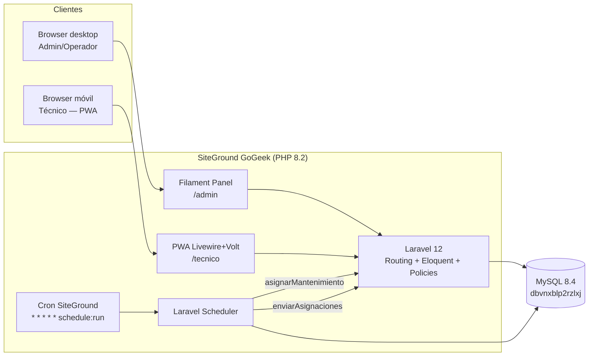
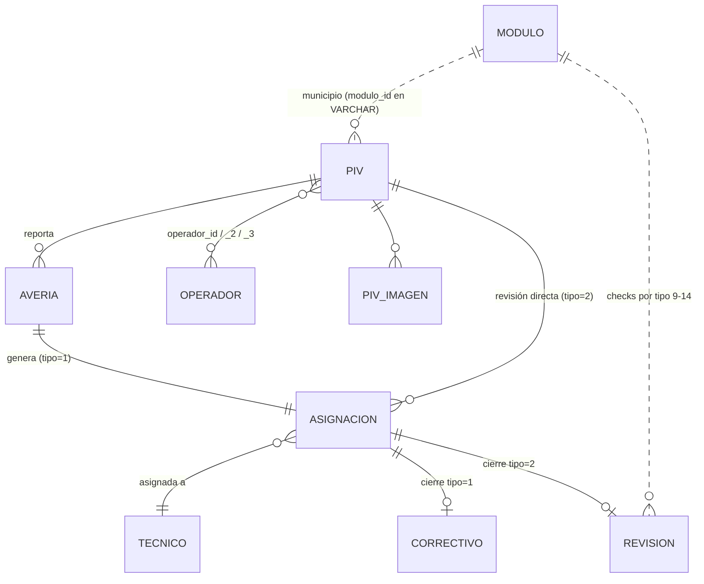

# Arquitectura — Winfin PIV

## 1. Visión general

Winfin PIV es un **CMMS** (Computerised Maintenance Management System) que gestiona el ciclo de vida operativo de **575 paneles de información al viajero** instalados en marquesinas de autobús: alta de incidencias por parte del operador, asignación a técnico, cierre con foto, revisiones mensuales programadas y reporting al cliente. Es **single-tenant** (Winfin Systems S.L.), web responsive con un panel Filament para back-office y una PWA Livewire para los técnicos en campo. **Sin integración con los paneles físicos**: toda la operativa es humana.

---

## 2. Contexto histórico

Existe una app PHP procedural (2014, retoques en 2025) en `https://winfin.es`. Funciona, pero arrastra deuda técnica grave que justifica reescritura completa en lugar de parcheo:

1. **Sesiones inconsistentes**: `header.php` lee `$_SESSION['user_level']` mientras `login.php` escribe `$_SESSION['userId']` → el menú no se renderiza correctamente en ningún rol según el flujo de código.
2. **Contraseñas en SHA1 sin sal** en las tablas `u1`, `tecnico`, `operador` — vulnerables a rainbow tables.
3. **`unserialize()` sobre cookie `admin_settings`** en `functions.php` — vector RCE clásico (CVE pattern).
4. **Dump SQL completo expuesto públicamente**: `https://winfin.es/serv19h17935_winfin_2025-04-25_07-53-24.sql` descargable por cualquiera, contiene contraseñas y datos personales — **incidente RGPD pendiente**.
5. **Charset mezclado**: tablas en `latin1`, conexión `utf8mb4`, `header.php` declara `utf-8`, `login.php` declara `ISO-8859-1`. Eñes y tildes inconsistentes.
6. **Sin CSRF** en formularios.
7. **PHP 8.2 marca deprecated** la creación dinámica de la propiedad `Piv::$tecnico_id` en `classes/Piv.php:42`. En PHP 9 será error fatal.
8. **Archivos `* copia*`** por todos lados (`paneles copia 2.php`, `login copia 1.php`...) — versionado manual sin documentar.
9. **Git con un único commit** ("Primer guardado de la app") y muchos cambios sin commitear.
10. **Bug de datos**: técnicos registran las **revisiones mensuales** rutinarias como **averías reales** (`asignacion.tipo=1`) con notas tipo `"REVISION MENSUAL Y OK"` en lugar de usar `tipo=2`. Contamina los KPIs del cliente.
11. **Sin tests, sin CI, sin documentación**.

**Por qué reescribir y no parchear**: los puntos 1-3 y 5 son arquitectónicos (sesión, charset, criptografía, deserialización). Refactorizarlos in-situ exige tocar prácticamente todos los archivos; cuesta lo mismo levantar Laravel encima de la misma BD y cortar a tajadas.

---

## 3. Stack y por qué

- **Laravel 12** — framework PHP maduro y soportado, ORM Eloquent ideal para una BD legacy con tablas reutilizadas.
- **Filament 3.2** — admin panel completo "out of the box": tablas, filtros, formularios, policies, widgets. Reduce semanas de UI back-office.
- **Livewire 3 + Volt + Tailwind 3** — UI reactiva mobile-first sin SPA framework; mantiene PHP como única fuente y permite PWA sin compilar a otra plataforma.
- **PWA (no nativa)** — los técnicos solo necesitan cámara, formulario y notificación push; la PWA cubre los tres con cero coste de tiendas.
- **Fortify (sin Breeze)** — el scaffolding visual de Breeze sobra; Fortify expone solo la lógica de auth, que integramos con Filament + nuestro guard custom SHA1→bcrypt.
- **Driver de queue `database`** — SiteGround GoGeek es compartido y no permite workers persistentes; usamos cron de SiteGround → `schedule:run` cada minuto.
- **Pest 3** — tests legibles, integración nativa con Laravel. (Versión instalada: 3.8.6 + pest-plugin-laravel 3.x. Pest 4 requiere PHP 8.3+, incompatible con prod SiteGround 8.2.30.)
- **MySQL existente (`dbvnxblp2rzlxj`)** — coexistencia con la app vieja sin migración de datos.

---

## 4. Arquitectura lógica



---

## 5. Modelo de dominio

### 5.1 Tablas legacy reutilizadas (NO se altera schema en Fase 1)

| Tabla | Campos clave | Comentario |
|-------|--------------|------------|
| `piv` | `id`, `codigo`, `municipio` (VARCHAR con `modulo_id`), `direccion`, `lat`, `lng`, `operador_id`, `operador_id_2`, `operador_id_3`, `mantenimiento`, `status` | Panel físico. Hasta 3 operadores responsables. |
| `averia` | `id`, `piv_id`, `fecha` (TIMESTAMP), `notas`, `operador_id`, `status` | Incidencia reportada. |
| `asignacion` | `id`, `averia_id`, `tecnico_id`, `tipo` (1=correctivo, 2=revisión), `fecha`, `status` | Asignación técnico↔avería/revisión. |
| `correctivo` | `id`, `asignacion_id`, `diagnostico`, `accion`, `fecha`, `imagen` | Cierre tipo=1. |
| `revision` | `id`, `asignacion_id`, `fecha` (VARCHAR(100)!), checks (`aspecto`, `funcionamiento`, `audio`, `fecha_hora`, `precision_paso`, `actuacion`), `notas` | Cierre tipo=2. |
| `tecnico` | `id`, `nombre_completo`, `dni`, `n_seguridad_social`, `ccc`, `telefono`, `direccion`, `email`, `password` (SHA1), `activo` | 65 en BD, 3 activos. **Datos RGPD sensibles**. |
| `operador` | `id`, `nombre`, `cif`, `responsable`, `email`, `domicilio`, `password` (SHA1) | 41 clientes finales. |
| `modulo` | `id`, `tipo`, `nombre` | Catálogo polimórfico (ver 5.3). |
| `piv_imagen` | `id`, `piv_id`, `path`, `fecha` | AUTO_INCREMENT=1510, filas reales=1135 → 375 huérfanos. |
| `instalador_piv` | `id`, `piv_id`, `instalador`, `fecha` | Histórico instalación. |
| `desinstalado_piv` | `id`, `piv_id`, `motivo`, `fecha` | Histórico desinstalación. |
| `reinstalado_piv` | `id`, `piv_id`, `fecha` | Histórico reinstalación. |
| `u1` | `id`, `username`, `email`, `password` (SHA1) | Admins (1 usuario hoy). |
| `session` | (legacy PHP) | No se toca; Laravel usa `lv_sessions`. |

### 5.2 Diagrama ER simplificado



### 5.3 Catálogo `modulo` (polimórfico por `tipo`)

| `tipo` | Uso |
|--------|-----|
| 9 | Aspecto |
| 10 | Funcionamiento |
| 11 | Actuación |
| 12 | Audio |
| 13 | Fecha/hora |
| 14 | Precisión de paso |
| (sin filtro) | Municipios — `piv.municipio` (VARCHAR) guarda el `modulo.id` numérico |

### 5.4 Tablas Laravel internas (prefijo `lv_`)

`lv_users`, `lv_sessions`, `lv_jobs`, `lv_cache`, `lv_password_reset_tokens`, `lv_failed_jobs`, `lv_personal_access_tokens`, `lv_notifications`, `lv_webpush_subscriptions`.

> **Decisión clave**: las tablas legacy **no se renombran ni se les añaden columnas en Fases 1-3**. Cualquier añadido (p.ej. `lv_password_migrated_at`) vive en tablas `lv_*` enlazadas por FK lógica. Ver [ADR-0002](docs/decisions/0002-database-coexistence.md).

---

## 6. Roles y permisos

| Recurso | Admin | Técnico | Operador | Notas |
|---------|:-----:|:-------:|:--------:|-------|
| `piv` | CRUD | R (solo asignados a él en sus asignaciones) | R (solo donde sea `operador_id`/`_2`/`_3`) | — |
| `averia` | CRUD | R (sus asignaciones) + U (cierre) | C + R (sus paneles) | Operador NUNCA cierra. |
| `asignacion` | CRUD | R + U (cierre, foto) | — | Solo admin reasigna. |
| `tecnico` | CRUD | R (su propia ficha, sin password) | — | RGPD: nunca exportar al operador. |
| `operador` | CRUD | — | R/U (su propia ficha) | — |
| `panel admin` (Filament) | Acceso completo | ❌ | ❌ | Técnico/operador van a sus PWAs. |

---

## 7. Flujos principales

### 7.a) Reporte de avería por operador

1. Operador entra en `piv.winfin.es`, login.
2. Ve su lista de paneles (filtrado por `operador_id IN (op_id, _2, _3)`).
3. Pulsa "Reportar avería" en un panel.
4. FormRequest valida: `piv_id` pertenece al operador, `notas` no vacío.
5. INSERT en `averia` (status=abierta, fecha=now).
6. Notificación email al admin + Web Push si hay técnico ya asignado al panel.

### 7.b) Asignación a técnico

**Manual (admin):**
1. Admin abre `averia` en Filament.
2. Action "Asignar técnico" → seleccciona `tecnico_id` activo + tipo=1.
3. INSERT en `asignacion`. Notificación Web Push al técnico.

**Automática (cron mensual):**
1. Scheduler diario revisa `piv.mantenimiento` (fecha próxima revisión).
2. Para cada PIV con revisión vencida y técnico asignado por ruta → INSERT `asignacion` con `tipo=2` (sin `averia_id`).

### 7.c) Cierre de avería

1. Técnico abre la asignación en su PWA.
2. Pulsa "Cerrar como avería real" (tipo=1) → form `Correctivo` (diagnóstico + acción + foto obligatoria).
3. Validación + INSERT en `correctivo`, `asignacion.status=cerrada`.
4. Email al admin y al operador del panel (sin datos RGPD del técnico, solo `nombre_completo`).

### 7.d) Registro de revisión mensual — **flujo SEPARADO** (ADR-0004)

1. Técnico entra a su PWA, panel/asignación de tipo=2.
2. Pulsa botón **distinto**: "Registrar revisión mensual".
3. Form `Revision`: checklist (aspecto, funcionamiento, audio, fecha_hora, precisión paso, actuación) + nota libre opcional + foto.
4. INSERT en `revision` con `asignacion_id`, `asignacion.status=cerrada`.
5. **NUNCA** entra al flujo de `correctivo`. **NUNCA** se escribe "REVISION MENSUAL" en `averia.notas`.

### 7.e) Mantenimiento programado (cron mensual)

1. Cron SiteGround (`* * * * *`) → `php artisan schedule:run`.
2. Job `AsignarMantenimientoMensual` (diario 06:00):
   - Recorre `piv` con `mantenimiento <= today`.
   - Crea `asignacion` `tipo=2` con técnico de ruta.
   - Actualiza próxima fecha en `piv.mantenimiento` (+1 mes).

### 7.f) Envío diario de asignaciones por email

1. Job `EnviarAsignacionesDiarias` (07:30 lunes-viernes).
2. Por cada técnico activo: agrupa asignaciones del día → Mailable HTML → envío.

---

## 8. Estrategia de migración SHA1 → bcrypt (lazy)

`lv_users` se rellena **al vuelo** en el primer login exitoso de cada usuario, sin seeder ni cron. La fila contiene `legacy_kind` ∈ {admin, tecnico, operador}, `legacy_id` apuntando a la tabla origen, y `password` bcrypt fresco. El SHA1 nunca persiste en `lv_users` después del primer login.

El `role-hint` viene fijado por la **ruta de login** (no hay selector ni columna):

- `/admin/login` → `legacy_kind = 'admin'` (busca en `u1`).
- `/tecnico/login` → `legacy_kind = 'tecnico'` (busca en `tecnico`).
- `/operador/login` → `legacy_kind = 'operador'` (busca en `operador`).

```php
// app/Auth/LegacyHashGuard.php (pseudocódigo simplificado — flujo completo en ADR-0003)
public function attempt(array $credentials, string $roleHint, Request $request): bool
{
    // 0. Rate limit antes de cualquier query (5 intentos/min por IP+email+rol).
    $rlKey = 'login:'.$request->ip().'|'.strtolower($credentials['email']).'|'.$roleHint;
    if (RateLimiter::tooManyAttempts($rlKey, 5)) {
        throw new TooManyRequestsException(RateLimiter::availableIn($rlKey));
    }

    // 1. SIEMPRE primero: resolver fila legacy por email. Es la fuente de verdad.
    $legacyTable = match ($roleHint) {
        'admin' => 'u1', 'tecnico' => 'tecnico', 'operador' => 'operador',
    };
    $legacy = DB::table($legacyTable)->where('email', $credentials['email'])->first();
    if (!$legacy) { RateLimiter::hit($rlKey, 60); return false; }

    // 2. Lookup canónico por (legacy_kind, legacy_id) — NUNCA por email en lv_users.
    $user = LvUser::where('legacy_kind', $roleHint)
        ->where('legacy_id', $legacy->id)
        ->first();

    // 3. Bcrypt happy path
    if ($user?->password && Hash::check($credentials['password'], $user->password)) {
        RateLimiter::clear($rlKey);
        return $this->login($user);
    }

    // 4. SHA1 timing-safe
    if (!hash_equals(sha1($credentials['password']), strtolower($legacy->password))) {
        RateLimiter::hit($rlKey, 60);
        return false;
    }

    // 5. Crear o actualizar lv_users con bcrypt fresco — por (legacy_kind, legacy_id).
    $user = LvUser::updateOrCreate(
        ['legacy_kind' => $roleHint, 'legacy_id' => $legacy->id],
        [
            'email'                   => $legacy->email,
            'name'                    => $legacy->nombre_completo ?? $legacy->nombre ?? $legacy->username,
            'password'                => Hash::make($credentials['password']),
            'legacy_password_sha1'    => null,
            'lv_password_migrated_at' => now(),
        ]
    );

    RateLimiter::clear($rlKey);
    return $this->login($user);
}
```

Ver [ADR-0003](docs/decisions/0003-auth-migration.md) para el flujo completo (incluido el caso "bcrypt falla porque la app vieja cambió el password después de la primera migración") y [ADR-0005](docs/decisions/0005-user-unification.md) para el modelo unificado de usuarios.

---

## 9. Coexistencia con la app vieja

- **Fases 1-3**: `winfin.es/*.php` sigue siendo la única vía operativa. `piv.winfin.es` solo lee BD (consultas, dashboards admin) sin escribir nada que la app vieja no entienda.
- **Fase 4 en adelante**: cada módulo nuevo intercepta su flujo:
  - Operador entra a `piv.winfin.es` para reportar averías.
  - Técnico entra a `piv.winfin.es` para cerrar.
  - Admin opera 100% en Filament.
- **Cuando todos los flujos estén migrados**: la app vieja se deja en **modo solo-lectura** (banner "Acceso histórico, usa piv.winfin.es") hasta el cutover de Fase 7.

---

## 10. Plan de cierre de la app vieja (Fase 7)

1. **Redirects 301** desde `winfin.es/*.php` a su equivalente en `piv.winfin.es` (mapping en `.htaccess`).
2. **Borrado del dump SQL público** `serv19h17935_winfin_2025-04-25_07-53-24.sql` (incidente RGPD documentado en `docs/security.md`).
3. **Mover** todos los `winfin.es/*.php` a una carpeta de archivo histórico **fuera de `public_html`** (p.ej. `~/legacy-winfin-2014/`).
4. **Actualizar `pagina_web/`** (web pública corporativa) para que el botón de login apunte a `piv.winfin.es`.
5. Comunicación a operadores y técnicos del cambio de URL.

---

## 11. Riesgos conocidos

- **Charset latin1 mezclado**: eñes/tildes pueden venir corruptas en exports. Mitigación: accessor en lectura **y mutator en escritura** (`mb_convert_encoding($value, 'ISO-8859-1', 'UTF-8')`) sobre cualquier campo de texto en modelos legacy. Sin el lado de escritura, un emoji en `notas` truncaría la fila o lanzaría `1366 Incorrect string value`.
- **375 imágenes huérfanas** en `piv_imagen` (AUTO_INCREMENT=1510 vs 1135 filas). Comando programado `lv:images-prune` mensual que reconcilia FS↔BD (Bloque 14b del roadmap).
- **Drift FS↔BD**: 1133 fotos en disco vs 1135 registros — 2 referencias rotas. Reportar y limpiar en primer `lv:images-prune`.
- **Notas contaminadas con "REVISION MENSUAL"**: la nueva UX lo previene (ADR-0004). Los datos históricos se limpian con un `UPDATE asignacion SET tipo=2 WHERE id IN (...)` puntual en el Bloque 02 del roadmap (excepción justificada al ADR-0002 — modifica contenido, no schema). En producción, dashboards filtran **solo por `asignacion.tipo`**, no por contenido de `notas`. El filtro LIKE descartado tras review externa por no atrapar variantes y ser scan lento sin índice.
- **SiteGround compartido**: no hay workers de queue persistentes. Estrategia: `queue:database` + `schedule:run` minutal. **Latencia de hasta 60s** en notificaciones encoladas — aceptable para bulk; para acciones puntuales del admin ("Asignar y notificar ahora") el código permite `dispatchSync()`.
- **N+1 queries en Filament Resources**: cualquier Resource con relación visible en la tabla debe override `getEloquentQuery()` con `->with([...])`. Tests con `expectQueryCount` cubren regresiones.
- **Emails duplicados entre `u1` / `tecnico` / `operador`**: posible. Resuelto por `role-hint` en la ruta de login (ADR-0005). Verificación SQL obligatoria en Bloque 02 antes de programar el guard en Bloque 06.
- **Sin staging hasta Bloque 15b**: deploy directo a producción durante Fases 1-2. Mitigación parcial vía CI (Bloque 01b) que falla en errores de Pint o tests. A partir de Bloque 15b, todos los deploys pasan staging primero.

---

## 12. Métricas de éxito por fase

| Fase | OK cuando… |
|------|-----------|
| 1 | `piv.winfin.es` muestra splash Laravel. |
| 2 | Admin entra al panel Filament con su usuario legacy (rehasheado). |
| 3 | Admin ve los 575 PIVs en una tabla con búsqueda y filtros. |
| 4 | Operador reporta avería desde `piv.winfin.es` y queda en BD. |
| 5 | Técnico cierra avería desde el móvil con foto. |
| 6 | Cron mensual crea asignaciones tipo=2 sin tocar la app vieja. |
| 7 | App vieja apagada, redirects 301 funcionando, dump público borrado. |
